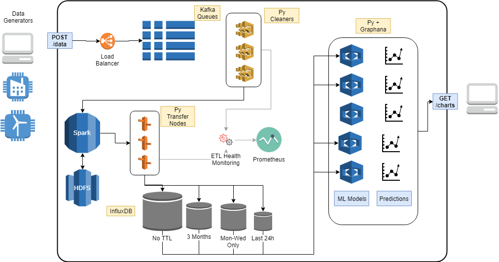

# Simple ETL Pipeline

Sample project to expriment building an ETL pipeline with Kafka, Apache Spark, Python and InfluxDB for timeseries data.

## Goals

## Design Overview

- Timeseries data is posted to REST endpoint
- Based on endpoint, reevant Kafka stream is populated
- Worker from a pool of Python instances picks up first available stream
- Cleans new entry and dumps it into Spark
- Second set of workers populate data into different instances of InfluxDB
- Each instance of InfluxDB has:
    1. Unique TTLs on entries.
    2. Supplies data to an independant DL/ML model.
    3. Stores different attributes of the original data.
- Independant pool of python workers that
    1. Use 1 or more instances of InfluxDB as data source.
    2. Use timeseries data to project/predict future values.
    3. Visualise the prediction in a realtime chart.

## Pipeline health and monitoring

- CPU/Memory with node exporter on each Python worker
- Log parsed event plotting for Python workers to track crashes.
- Log parsed event plotting to see load (entries processed/min)
- Kafka queue size plotting

## Order of Progress

- Setup Spark streaming with containers

## Books & Refrences

Advanced Analytics with Spark - Patterns for Learning from Data at Scale (O'Reilly, 2015)
Big Data Principles and Best Practices of Scalable Realtime Data Systems (Manning, 2015)
Data Analytics with Hadoop - An Introduction for Data Scientists by O’Reilly (2016)
Designing Data Intensive Applications by Martin Kleppmann O’Reilly Media (2017)
Doing Data Science - Straight Talk from the Frontline-O'Reilly Media (2013)
Learning Spark - Lightning-Fast Big Data Analysis (O'Reilly, 2015)

